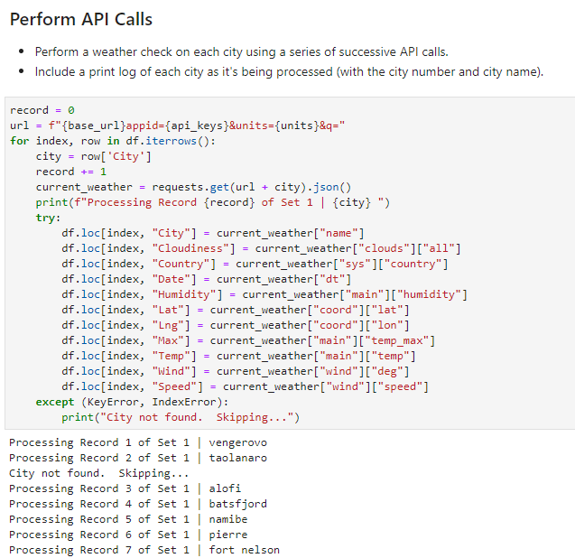

# What's the Weather Like?

## Background

Whether financial, political, or social -- data's true power lies in its ability to answer questions definitively. Test your knowledge of Python requests, APIs, and JSON traversals to provide a concrete explanation to the fundamental question: "What's the weather like as we approach the equator?"

Now, we know what you may be thinking: _"Duh. It gets hotter..."_

But, if pressed, how would you **prove** it?

## Summary (with links to my code and visualizations)

Use Pythonic concepts and API interactions to gather weather data of 500+ [randomly generated cities](Images/Random_Cities.png) on February 8th, 2019. Then use this data to create [four plots](Images/Four_Plots2.png), as detailed below. At the end of your [code](WeatherPy.ipynb) (snippet below) include a written description of three observable trends based on the data analysis.

## WeatherPy

Create a Python script to visualize the weather of 500+ cities across the world of varying distance from the equator. To accomplish this, you'll utilize a [simple Python library](https://pypi.python.org/pypi/citipy), [OpenWeatherMap API](https://openweathermap.org/api), and a little common sense to create a representative model of weather across world cities.

Your objective is to build a series of scatter plots to showcase the following relationships:

* Temperature (F) vs. Latitude
* Humidity (%) vs. Latitude
* Cloudiness (%) vs. Latitude
* Wind Speed (mph) vs. Latitude

Your final notebook must:

* Randomly generate **at least** 500 unique (non-repeat) cities based on latitude and longitude.
* Perform a weather check on each of the cities using a series of successive API calls.
* Include a print log of each city as it's being processed with the city number and city name.
* Save both a CSV of all data retrieved and png images for each scatter plot.

As final considerations:

* Complete your analysis using a Jupyter notebook.
* Use the Matplotlib or Pandas plotting libraries.
* Include a written description of three observable trends based on the data.
* To better present the information, use proper labeling of your plots.

## Considerations

* You may want to begin by refreshing yourself on the [geographic coordinate system](http://desktop.arcgis.com/en/arcmap/10.3/guide-books/map-projections/about-geographic-coordinate-systems.htm).

* Next, spend the requisite time necessary to study the OpenWeatherMap API. Based on your initial study, you should be able to answer basic questions about the API: Where do you request the API key? Which Weather API in particular will you need? What URL endpoints does it expect? What JSON structure does it respond with? Before you write a line of code, you should be aiming to have a crystal clear understanding of your intended outcome.

* In building your script, pay attention to the cities you are using in your query pool. Are you getting coverage of the full gamut of latitudes and longitudes? Or are you simply choosing 500 cities concentrated in one region of the world? Even if you were a geographic genius, simply rattling 500 cities based on your human selection would create a biased dataset. Be thinking of how you should counter this. (Hint: Consider the full range of latitudes).